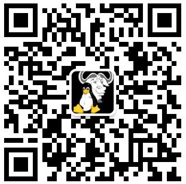

## 加入我们     
深圳 GNU/Linux 用户组，简称 Shenzhen LUG，是一个完全的非盈利社区，你的加入和参与不需要任何人的同意。

不同的通信工具，对应不同的通信级别 ，本质是和人沟通，而不是沟通工具。满足不同需求，选择你觉得舒服和喜欢的即可，不同的工具上的可能有不同个性的伙伴。

 - 电报群: https://t.me/shenzhenlug
 - 微信群： 微信群因其封闭性，无法直接添加，请已经在群中的朋友邀请进入。（或者搜索：opensourceleslie 注明：深圳lug，邀请加入微信群）
 
